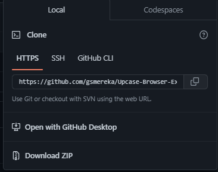
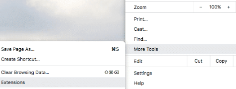
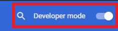
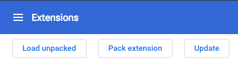
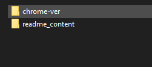
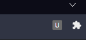

# Upcase-Browser-Extension
A simple extension that upcase some texts.

## About the Project
Its about training the princples of making an extension

## How to use
  

1 - Insert the text in the input box.  
2 - Click in the Upcase Button.  

## How to install (google chrome or brave)

1 - Get the content  
  
2 - Search where configurate extensions in your browser    
  
3 - Turn on Developer Mode in your browser  
  
4 - Click on Load Unpacked  
  
5 - Select 'chrome-ver' folder in the downloaded content    
  
6 - Enjoy your extension  
    