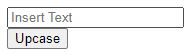

# Upcase-Browser-Extension
A simple extension that upcase some texts.

## About the Project
Its about training the princples of making an extension

## How to use
  

1 - Insert the text in the input box.
2 - Click in the Upcase Button.